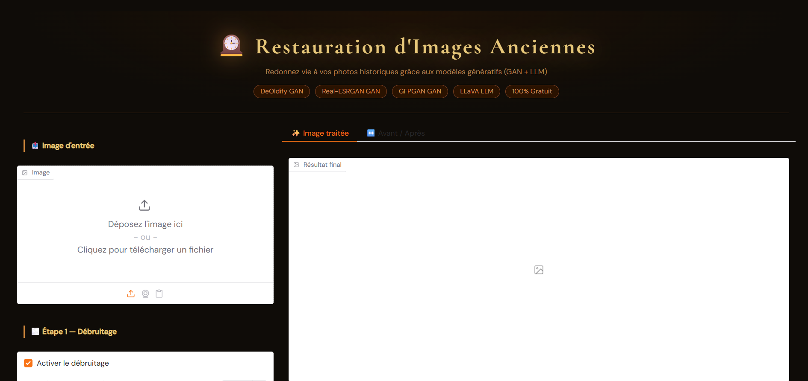
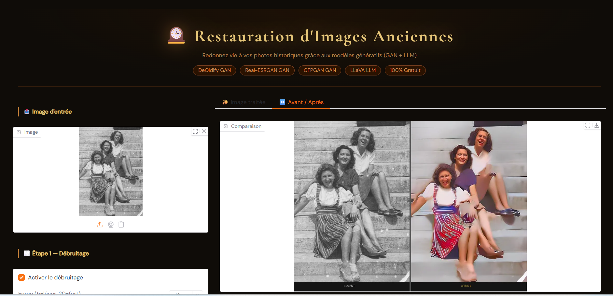

# 🖼️ Restauration et Colorisation d'Images Anciennes

## Description
Application IA qui restaure et colorise des photos anciennes
grâce aux modèles génératifs GAN et LLM.

## Modèles génératifs utilisés
| Modèle | Type | Rôle |
|--------|------|------|
|DeOldify| GAN | Colorisation N&B → Couleur |
|GFPGAN v1.4| GAN | Restauration visages |
|Real-ESRGAN x4| GAN | Super-résolution |
| LLaVA 7B | LLM | Description textuelle |

## Interface Web

## Avant / Après

## Comment lancer
1. Ouvrir dans Google Colab
2. Exécution → GPU T4
3. Exécuter toutes les cellules
4. Copier le lien gradio.live

## Étudiants
- Hamdi Ahlem

## Technologies
Python • PyTorch • Gradio • DeOldify • GFPGAN • Real-ESRGAN • LLaVA
